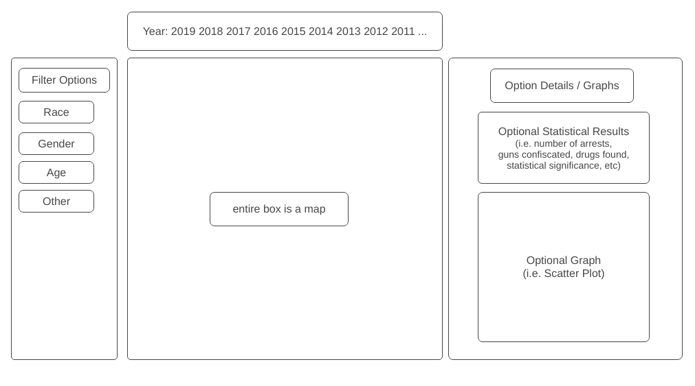

## Stop and Frisk!

### Background

Stop and Frisk is a proactive policing practice implemented by New York City Police Department to prevent crime. Theoretically, the law enforcement agents stop anyone whose behaviour seem to be suspicious; they stop the person, ask relevant questions, and potentially search the suspect if they deem necessary. This encounter could lead to an arrest of a suspect given the circumstance.

Overall, the policy is highly scrutinized due to public perception of its alleged racial bias towards minorities and low rates of effectiveness. 

### Features & MPV

+ Features:
    - Illustrate the geo-location of each police stop on the map alongside its outcome (arrest or free to go)
    - Ability to filter data (year, race, ethnicity, gender, age, location of stop)
    - Heatmap of police stops (green for each stop, red-yellow for each arrest)
    - Additional crime related statistics
    
+ Optional feature(s):
    - Graph Number of Stops against Time
    - tbd 

### Wireframes

### Architecture and Technologies

+ This project will be implemented with the following technologies: 
    - Javascript for logic
    - D3.js with HTML5 for effects rendering
    - Google Maps API with Google Heatmap for effects rendering

### Implementation Timeline

+ Day 1
    - Install all dependencies / Setup all necessary Node modules
    - Have a running webpack
    - Obtain necessary data (either through an API or CSV)
    - Familiarize with D3
    - Familiarize with Google Maps API
    - Familiarize with Google Heatmap

    Goal: Render something on the window

+ Day 2
    - Show map
    - Load data, understand data, and most importantly be able to manipulate data
    - Figure out how to output data
    - Figure out how to present data based on user enabled filtering paramter(s)

+ Day 3
    - Work on Styling
    - Figure out how to make the illustration dynamic
    - Fix bugs
    - Style again